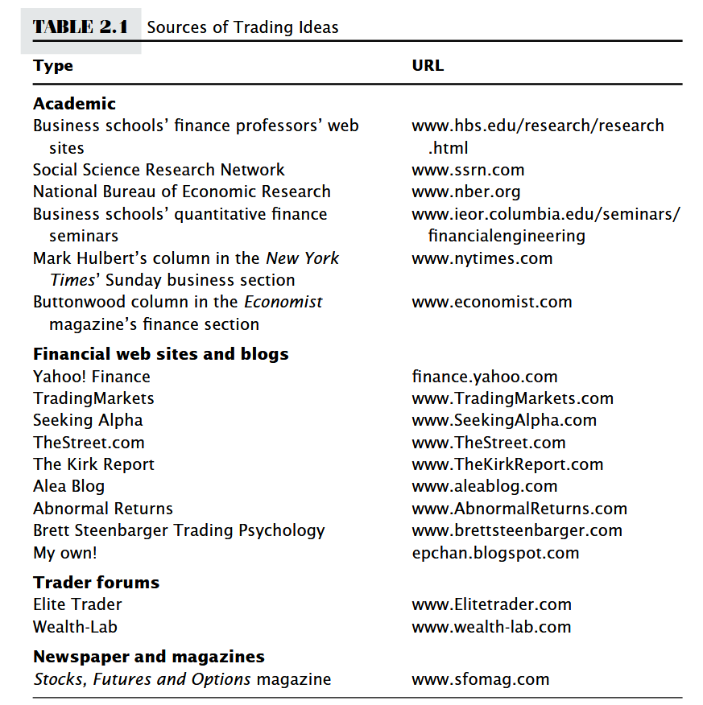
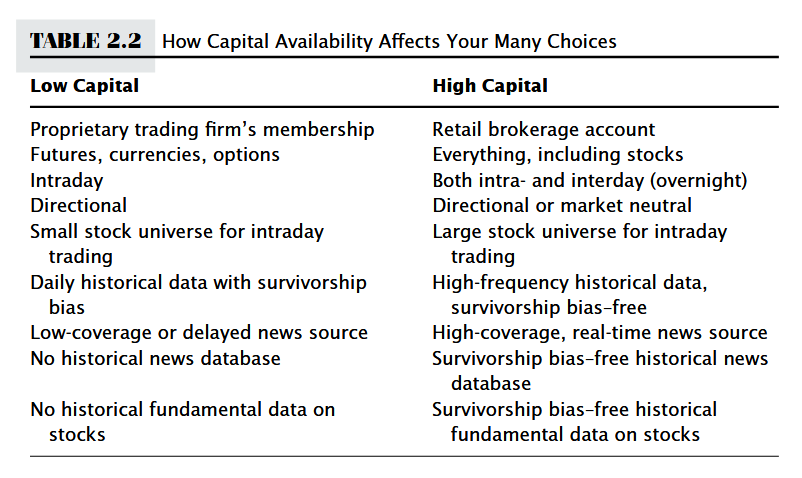
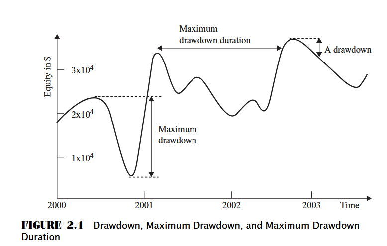
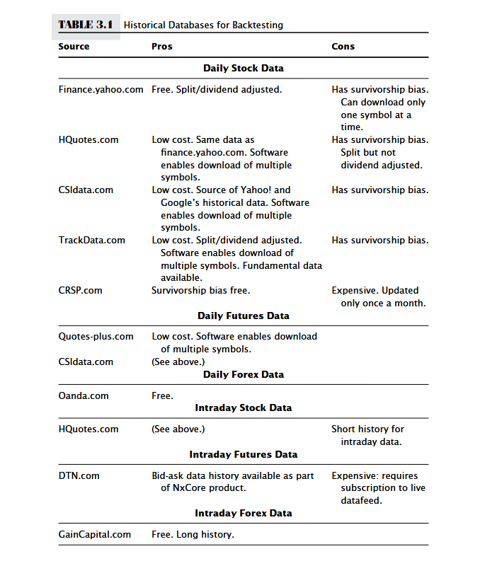

# Chapter 2: Where can we find good strategies?

## How to find strategies
- Simpler strategies may work better than complicated papers
- Most ready-made strategies do not withstand careful backtesting
- However, you can modify basic strategy and make it profitable
=> Try multiple variations of a basic strategy

## How to identify a strategy that suits you
- Working hours: High automation will help with this
- Programming skills
- Trading capital
- 
- Goal
  - The more regular the profits and income, the shorter the holding period should be
  - Maximize the Sharpe ratio

## A taste for plausible strategies and their pitfalls

### Some definitions
- Futures: These are agreements between two parties to exchange a specific asset (like a commodity, currency, or stock index) at a fixed price on a future date
- Long: Expect profit -> buy = make profit
- Short: Expect deficit -> sell = make profit
- Excess Returns = Portfolio returns - Benchmark returns
- Benchmark returns: The market index to which the securities you are trading belong.

### Number of quick checks before backtesting/trading to save time and money
- Comparison with benchmark, how consistent are returns?

**Information Ratio (Sharpe ratio)**
- Use when assessing a long-only strategy
- Information Ratio = Avg. Excess Returns / Std Dev. Excess Returns
- Sharpe ratio: special case of information ratio (suitable for dollar-neutral strategy (long = short)) => benchmark to use is always the risk-free rate.
- Higher sharpe ratio -> more profits (allows to trade at a higher leverage, it's the leveraged return that matters in the end)
- How to figure out the sharpe ratio of a strategy:
  - Email the author
  - Educated guess:
    - If a strategy trades only a few times a year, Sharpe ratio are likely not high
    - Deep (>10%) or length (4+ months) drawdowns -> unlikely to have high Sharpe ratio.
    - Drawdown: 
    - Values
      - <1: Not suitable as a stand-alone strat
      - 2: profitable every month
      - 3: profitable almost everyday 

### Drawdown
- Definition
  - Time t
  - global max - current value
  - Max drawdown: Max (global max (at time t) - value (time t))
  - Max drawdown duration: Longest it has taken for the equity curve to recover losses
- How deep and long of a drawdown can you tolerate without shutting down the strategy?

### Transaction costs and its affect on the strategy

- **Cost of liquidity** (market prices -> bid-ask spread, limit orders -> avoid liquidity costs but incur opportunity costs)
- **Market impact**: effect on market prices due to your own order (can contribute to a large part of total transaction cost)
- Delay (internet, software-related) -> **"slippage"** (difference between the order price and execution price)
- **Estimate transaction costs**: Half the average bid-ask spread + commission (if order-size is not much bigger than average sizes of best bid and offer)

### Does Data Suffer from Suvivorship Bias
- Companies may disappear (bankruptcy, mergers, ...)
- Backtesting a strategy using data with survivorship bias may be dangerous (historical performance get inflated)
- Especially true if the strategy tends to buy cheap

### How did performance of strategy change over the years?
- Most strategies performed better in the past (10 years ago) because there weren't many hedge funds.
- Also, bid-ask spreads were higher in the past (can't assume today's transaction cost)
- **Pay attention to its performace in recent few years**
- "Regime shifts" in financial margets can mean that data from an earlier period cannot be fitted to the same model that is applicable today.
  - Major regime shifts: Changes in market regulation, macroeconomic events

### Data-snooping bias
- More rules + parameters -> easier to overfit model

### "Fly under the radar" of instituitonal money managers
- Look for strategies that fly under the radar of big companies.
  - Lower capacities (trade too often)
  - Trade very few stocks everyday
  - infrequent positions
- Likely still to be profitable because have not been completely arbitraged away by hedge funds

## Summary
- Step 1: Find prospective trading strategies
  - business school + economic research sites
  - Financial sties + blogs focusing on investors
  - Trader forums
- Step 2: Pick the best handful following these questions
  - Time?
  - Programming skills?
  - Capital?
  - Goal?
- Step 3: Filter out some unsuitable strategies using questions noted above
  - outperform a benchmark?
  - high Sharpe ratio?
  - small + short enough drawdown
  - backtest suffer from bias?
  - "niche" that protects from competition from hedge funds

# Chapter 3: Backtesting

## Finding and using historical databases
- Sources: 
- Find data source that is already adjusted for splits and dividends (e.g. yahoo finance)
- Use open and close prices instead of high and low (very noisy) for less backtesting errors

## Performance measurement
- Two most important numbers: Sharpe ratio + drawdown
### Sharpe ratio
- Should we subtract risk-free rate (benchmark (treasury)) from a dollar-neutral (buy and sell to make money)? 
  - No because the financing cost is small and can be neglected. Also there's a margin balance to maintain to earns a credit close to risk-free rate.
  - Same for long-only. Only include risk-free rate if finance cost is considerable
  - Annualized Sharpe Ratio: sqrt(N_t) * Sharpe ratio based on T (T: period, N_t: number of t periods annually)

